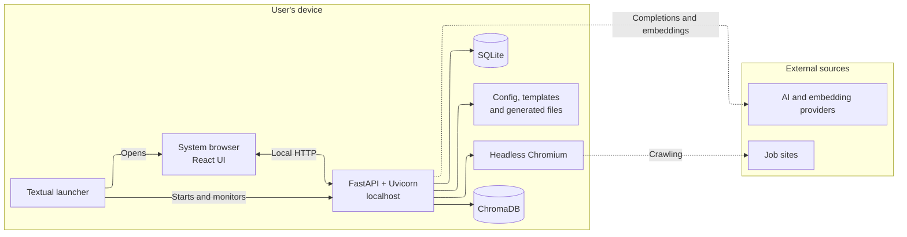
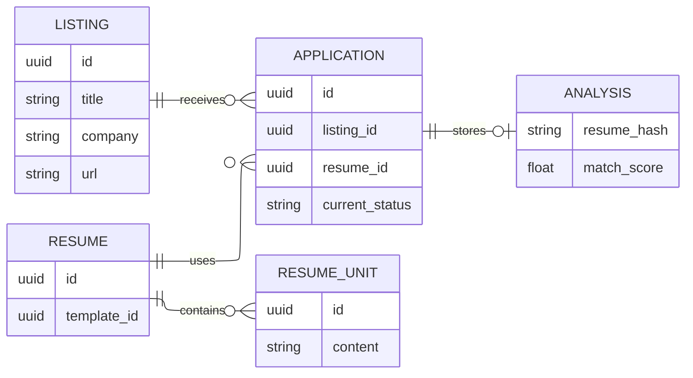

import ScreenshotStack from '../../../components/shared/ScreenshotStack.astro';
import listings from './pages/listings.png';
import newListing from './pages/new-listing.png';
import resumeEditor from './pages/resume-editor.png';
import tui from './pages/tui.png';

## Overview

Atto is a local-first, open-source workspace for organizing a job search. It connects job listings, applications, resumes, AI-assisted review, and application history in one place instead of scattering them across spreadsheets, browser tabs, folders, and notes.

I designed and built the full product: the React interface, FastAPI backend, local persistence, scraping, resume editor and PDF workflow, testing strategy, and Windows/Linux release packaging.

The central product choice is simple: the job-search data stays on the user's device by default. Atto can still use the network for scraping, embeddings, and model calls, but the core records and provider configuration do not require a hosted account or database.

### The Problem

A job search produces a surprising amount of sensitive and interconnected data: saved roles, application history, resumes, interview notes, and records of past outcomes. I wanted a way to manage that information without handing it to an untrusted third party just to manage a job search.

I tried existing local tools first. One promising option was [Resume Matcher](https://github.com/srbhr/resume-matcher), but I could not get it or the other options to work reliably for the workflow I wanted. Most alternatives also solved only one part of the problem: trackers focused on application status, resume tools focused on document generation, and browser extensions focused on saving listings.

That fragmentation made even simple questions harder to answer. Which resume did I use for a particular role? Why did I prioritize one application over another? What changed between resume versions? Which companies still needed a follow-up?

Thus, Atto was built to solve my own pain points. The goal was to keep the core data local and model the job search as one connected workflow.

### The Product

<ScreenshotStack
	images={[
		{
			src: newListing,
			caption: 'Reviewing job details extracted from a listing',
		},
		{
			src: listings,
			caption: 'Tracking saved listings and active applications',
		},
		{
			src: resumeEditor,
			caption: 'Editing a resume beside its rendered PDF preview',
		},
	]}
/>

Atto turns a job page into a structured, reviewable listing. Users can paste a URL and Atto crawls the page, filters out navigation and other low-value content, extracts the role details, validates the result, checks for duplicates, and presents a draft before anything is saved. When a page cannot be accessed reliably, users can paste the job description directly instead.

From there, the opportunity can be tracked through stages such as `saved → applied → screening → interview → offer`. Each application preserves its status history and keeps the resume used for that role attached to the same record.

Resumes are built from structured sections and local HTML templates. Atto compares a resume against a saved listing, produces a match breakdown, and generates targeted suggestions. The dashboard then connects listings, applications, resumes, analyses, and outcomes into one local job-search history.

## Technical Architecture

### Local-First Design

Atto runs entirely on the user's machine. The React interface, FastAPI backend, SQLite database, Chroma vector store, templates, generated PDFs, and provider configuration all live locally. Listings, applications, resumes, and analysis results do not require a hosted account or database.

<ScreenshotStack
	images={[
		{
			src: tui,
			caption: 'Local launcher showing the application server status',
		},
	]}
/>

The packaged app starts with a Textual launcher rather than a raw terminal window. The launcher runs FastAPI as a child process, waits for its health check to pass, and opens the React interface in the user's default browser. This gives the local server a small product-facing TUI for startup progress, runtime status, and errors instead of exposing scrolling Uvicorn logs.

The local boundary does not mean every feature works offline. Scraping still reaches job sites, and AI features send model or embedding requests to the provider configured by the user. The core workspace remains local, while only the data required for those external operations leaves the device.

### Data Model

Atto keeps the main job-search records connected rather than treating tracking, resumes, and analysis as separate tools.

This lets Atto retain the listing behind an application, the resume submitted for it, its status history, and the analysis generated against that resume. Stable resume-unit IDs also allow suggestions and PDF highlights to remain attached to the exact content they refer to.

### Engineering Deep Dives

This case study stays at the product level. The linked posts cover implementation decisions and the problems behind them in more detail.

#### Listing Ingestion

Job pages are unreliable inputs. Atto normalizes URLs, detects duplicates, validates extracted listings, and lets users paste the job description when a page is blocked or incomplete. The result is a reviewable draft instead of an opaque automatic save.

> Read more: [Designing and Testing Atto's Listing Pipeline](https://atto.austinkong.me/blog/designing-and-testing-attos-listing-pipeline/) covers browser crawling, duplicate detection, pasted-content recovery, and the tests around the pipeline.

#### Resume Analysis

Atto combines skill coverage with content quality rather than reducing a resume to one unexplained score. Skill coverage contributes 75% of the result and content quality contributes 25%; suggestions target stable resume-unit IDs and become stale when the underlying content changes.

> Read more: [Atto's LLM Resume Analysis System](https://atto.austinkong.me/blog/attos-llm-resume-analysis-system/) explains the hybrid scoring model, grounded suggestions, and relative evaluation.

#### PDF Rendering

The resume editor previews the actual HTML-to-PDF output. Playwright Chromium renders the document, annotation markers identify resume units in the PDF, and normalized rectangles let the UI place highlights over wrapped text. The frontend double-buffers the viewers so a document can finish rendering before it becomes visible.

> Read more: [Inside Atto's PDF Rendering Pipeline](https://atto.austinkong.me/blog/inside-attos-pdf-rendering-pipeline/) goes deeper into annotation-based geometry, stable IDs, normalized coordinates, and the double-buffered preview.

#### Testing Probabilistic Features

AI output and web pages are not stable enough for one end-to-end suite to be the source of truth. I split testing across deterministic unit tests, integration tests with fake providers, and opt-in evaluations against real models. LLM judges assess qualities such as groundedness and usefulness without requiring one exact response.

I also added a "Paper Mode" to Atto for reproducible demos and exploration. The idea came from paper trading accounts in finance. It produces a local workspace with versioned fixture data that look like real job-search records, but without using personal data or live model calls.

### Packaging and Releases

Atto has two distribution paths built from the same application. PyInstaller bundles the Python runtime, backend, built frontend, templates, and fixture data into downloadable Windows and Linux releases. Those builds give users the lowest-friction setup: download the artifact and run Atto without installing Python, Node.js, or a database.

I chose not to ship a macOS executable because distributing one responsibly requires Apple code signing and notarization, which required a $100 Apple Developer account. Instead, Atto is also published as a platform-independent wheel on PyPI. `pip install atto-app` works on macOS, Windows, and Linux and is easier to update, but transfers setup work to the user: they need a supported Python version, `pip`, and an environment where Python-installed commands are available.

Both paths serve the same built React interface from the local FastAPI process. GitHub Actions builds the Windows and Linux artifacts on their native runners, while a separate release workflow builds and publishes the PyPI package. Playwright's Chromium runtime remains a post-install download rather than being embedded in every artifact, which keeps releases smaller but makes first launch slower and dependent on network access.

## Tradeoffs

### Local-First vs Hosted

Atto's local-first design gives users control over sensitive job-search data, but it also moves responsibilities that a hosted service would normally absorb.

There is no automatic multi-device sync, cloud backup, or account recovery. The local workspace is the source of truth, so users are responsible for moving or backing up their data. Schema changes must also preserve existing SQLite databases rather than assuming every user starts from a clean deployment.

Local-first does not mean fully offline or fully private. Listings, applications, and resumes are stored locally, but scraping still connects to job sites and AI features send the relevant content to the configured provider. Atto makes that boundary explicit and stores provider credentials locally, but it cannot remove the privacy implications of those external calls.

### Browser UI vs Electron

Using the system browser let me reuse the React application without maintaining an Electron or Tauri shell. Atto's Windows and Linux bundles are already about 190 MB; bundling another browser runtime for the interface would make them materially larger (probably double or triple the current size with Electron).

As discussed earlier, native desktop packaging would not remove signing and notarization requirements. The tradeoff is that Atto feels more like a local web application, and the launcher must manage a background server process. Playwright still requires Chromium, but downloads it separately only when crawling or PDF rendering is first used.

## Outcome

Atto has passed 700 combined downloads and installs across PyPI and GitHub releases as of 27 July 2026.

The result is the local job-search tool I could not find: one place to collect opportunities, track applications, tailor resumes, inspect AI feedback, and export a polished document while keeping the underlying workspace under the user's control.
