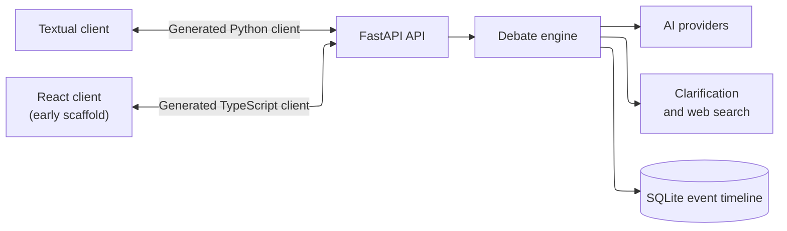

import WorkInProgress from '../../../components/shared/WorkInProgress.astro';

## Overview

Logos is an open-source experiment in making AI-assisted decisions easier to inspect. Instead of asking one model for a final answer, it gives several configured participants the same problem, gathers independent proposals, runs a structured debate, and applies a separate resolution strategy.

I am building Logos around a simple premise: for decisions where assumptions and tradeoffs matter, the path to an answer is often as important as the answer itself. A debate makes competing positions, challenges, clarification questions, tool use, and votes visible rather than hiding them behind one response.

The project is still in active development. The engine and terminal client work today, while the broader product experience is still taking shape.

### The Problem

A single model response can be persuasive without revealing which alternatives it ignored or which assumptions it failed to test. Asking several models separately produces more material, but leaves the user to compare disconnected answers and resolve disagreements by hand.

Logos turns that comparison into an explicit workflow. Participants begin from their own instructions and models, commit to independent proposals, then respond to the strongest points raised by others. Resolution is handled separately so the agents making arguments are not also silently deciding which argument won.

### The Current Workflow

A Logos session moves through four stages:

1. Discovery: each participant privately decides whether essential user context is missing and can ask focused clarification questions.
2. Proposal: participants produce independent opening answers before seeing competing proposals.
3. Debate: participants challenge, refine, or revise positions over a configured number of rounds.
4. Resolution: an AI judge, a jury, or no automatic resolver closes the session.

Sessions can use round-robin or seeded shuffled turn order, full or sliding-window history, and optional clarification and web-search tools. Participants can use models from OpenAI, Anthropic, Gemini, or DeepSeek.

## Technical Architecture

The FastAPI service is the source of truth. It owns session configuration, orchestration, persistence, model providers, tools, and server-sent event streams. SQLite stores sessions and their event timelines, while generated OpenAPI clients keep the Textual and React consumers aligned with the API contract.

The engine advances one event at a time through discovery, proposal, debate, and resolution. Messages, reasoning, questions, search results, votes, and lifecycle changes are persisted as typed events. Generated tokens and completed events are streamed independently, so clients can show a response as it is produced without treating an incomplete message as committed history.

This event timeline also lets a session stop cleanly when a participant asks the user a question. Once the answer is recorded, the same engine resumes from persisted state rather than relying on an in-memory agent loop.

## Current Status

Logos can configure and run end-to-end debates, stream their progress, pause for user clarification, search the web, persist the event history, and resolve the result with a judge or jury. The next step is not to add every imagined debate protocol; it is to make this core workflow reliable, understandable, and useful before expanding it.

<WorkInProgress />