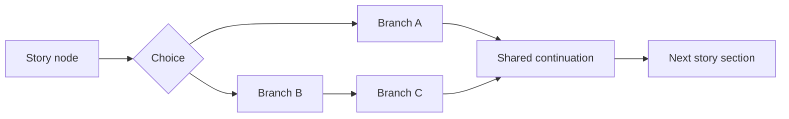
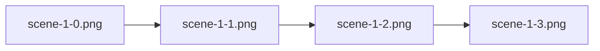
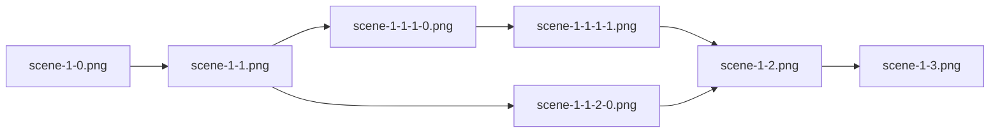

import CaptionedImage from '../../../components/shared/CaptionedImage.astro';
import ScreenshotStack from '../../../components/shared/ScreenshotStack.astro';
import experiment from './screens/experiment.jpg';
import nucleation from './screens/nucleation.jpg';
import sequenceAlignment from './screens/sequence-alignment.jpg';
import visualNovel from './screens/visual-novel.jpg';
import xrayDiffraction from './screens/xray-diffraction.jpg';
import midjourney from './midjourney.png';
import visualNovelCombined from './visual-novel-combined.jpg';

## Overview

Protein Lab is an educational 2D game developed for NUS Open House 2026. It introduces primary school learners to the history, scientific process, and real-world applications of protein crystallization through a combination of visual storytelling, laboratory activities, and science-inspired minigames.

I built the Unity application from scratch and was the project's only programmer for the majority of development. A second programmer later joined to implement the final interactive laboratory experiments. I was responsible for the rest of the technical experience, including the application structure, visual-novel framework, user interface, minigames, audio integration, touch input, scene progression, optimization, and WebGL deployment.

The wider team included a graphic designer, scientific researchers, and a project lead with a Doctor of Pharmaceutical Sciences. The researchers defined the educational content and reviewed the scientific concepts, while I translated their material into interactions that were technically feasible and understandable to younger learners.

### The Experience

<ScreenshotStack
	images={[
		{
			src: visualNovel,
			caption: 'Illustrated visual novel introducing protein crystallization',
		},
		{
			src: experiment,
			caption: 'Guided activity for preparing a protein solution',
		},
		{
			src: nucleation,
			caption: 'Nucleation minigame for sorting compatible molecules',
		},
	]}
/>

The project is divided into three connected parts:

1. A four-act visual novel covering the history and applications of protein crystallization.
2. Guided laboratory activities for preparing solutions and carrying out a simplified crystallization procedure.
3. Three minigames that reinterpret scientific techniques as short, replayable interactions.

The visual novel acts as the main educational narrative. Learners move through illustrated and narrated scenes, occasionally choosing between alternative explanations or perspectives. Completing acts unlocks later content within the same session.

The laboratory activities then guide learners through the preparation of buffer, salt, and protein solutions before a simplified crystallization experiment.

The minigames explore nucleation, sequence alignment, and X-ray diffraction. They do not attempt to reproduce the complete scientific procedures. Instead, each one isolates a central idea and expresses it through a mechanic that can be understood within a short play session.

## Visual-Novel Framework

<CaptionedImage
	src={visualNovelCombined}
	caption="Story frames combine illustrated characters, dialogue, and scientific explanations"
/>

The visual novel contains approximately 240 story pages across four acts.

Rather than writing separate scene logic for every page, I represented the story as a data-driven graph of Unity `ScriptableObject` assets. Each page is a `StoryNode` containing:

- A full-page illustration
- Optional narration audio
- An optional background-music reference
- A reference to the next node
- A list of choices pointing to alternative nodes
- An optional unlock key for progression

A reusable `StoryManager` reads the current node, displays its artwork, plays its narration, configures the available choices, and advances through the graph.

### Narrative as a Directed Acyclic Graph

The visual novel is structured as a directed acyclic graph.

Most nodes point linearly to the next page. At a decision point, a node can instead point to two alternative branches. These branches contain short sequences of nodes before eventually reconverging into the main story.



The completed story contains only four two-way choice points, but the system is otherwise extensible to any number of choice points and choice options. The choices change which explanation or perspective the learner encounters, but they do not create persistent consequences, conditional dialogue, or alternate endings.

### Baked Frames and Runtime Dialogue

Each visual-novel page was delivered as a single composed image. Character portraits, backgrounds, dialogue boxes, and dialogue text were baked into the frame by the graphic designer.

My original framework supported rendering dialogue text separately at runtime. However, that feature became unnecessary once the artwork arrived with the text already included, so I disabled it for normal story pages.

This kept the runtime renderer simple: displaying a page generally required replacing one sprite and playing one audio clip. However, it also tightly coupled dialogue revisions to the visual assets. Changing one sentence required the graphic designer to edit and re-export the entire page rather than updating a text field in Unity.

Choices still had to remain separate UI elements. Unlike static dialogue, a choice requires an interactive bounding area and click handling. When a node contains choices, the manager creates reusable buttons using the framework's dialogue-option system.

Loading a node therefore performs one coordinated operation:

1. Replace the displayed story image.
2. Play the node's narration audio.
3. Optionally change the background music.
4. Bind each choice button to its destination node for branching nodes.

Scene-to-scene navigation is handled separately by a persistent scene manager.

### Evolution of the Authoring Workflow

The first authoring approach attempted to derive story order from filenames.

A linear sequence could use names such as:



A one-level branching sequence could use names such as:



The filename breaks down into values for act, page, and branch:

```text
scene-{act}-{page}-{branch}-{branch page}
```

The system could then parse the filename to determine the next node or branch. Sub-branches could be added by appending more `{sub-branch}-{sub-branch page}` values to the end of the filename recursively.

The scheme was technically workable, but it created two practical problems.

First, the naming convention was difficult to communicate, especially to third parties such as the graphic designer. A small filename error could place a frame in the wrong branch or disconnect it from the intended sequence, and I frequently had to correct imported assets manually.

Second, the story changed throughout development. Inserting or removing a panel meant renaming every subsequent frame to preserve the sequence. I used tools such as Windows PowerToys PowerRename to automate parts of the process, but revisions still produced unnecessary file-management work.

Thus, I replaced the convention-based system with explicit references between nodes. Adding or removing a page no longer shifted the identity of every later page. A new page could be inserted by creating a node, assigning its image and narration, and changing two references.

The tradeoff moved elsewhere. Creating and linking 200+ node assets through Unity's Inspector required substantial manual dragging. At this project scale, that was acceptable as a mostly one-off authoring task, but it would not scale well to a longer or frequently revised visual novel.

Given another iteration, I would preserve the node graph while improving the authoring layer. Possible approaches include:

- A custom graphical editor for connecting story nodes
- An importer that creates nodes from a structured manifest
- A small textual format for declaring links

For example, something similar to how Mermaid diagrams declare flowcharts:

```text
act1/page-01.png -> act1/page-02.png
act1/page-02.png -> {
    "Learn about crystals": act1/branch-crystals-01.png,
    "Learn about proteins": act1/branch-proteins-01.png
}
act1/branch-crystals-01.png -> act1/branch-crystals-02.png -> act1/page-03.png
act1/branch-proteins-01.png -> act1/page-03.png
```

This would retain explicit graph relationships without requiring every edge to be configured manually through the Inspector.

## Designing for Young Learners

The main product challenge was deciding how much scientific and mechanical complexity the target audience could reasonably handle.

### Simplifying the Laboratory Concept

The original laboratory concept was inspired by [Potion Craft: Alchemist Simulator](https://store.steampowered.com/app/1210320/Potion_Craft_Alchemist_Simulator/). I prototyped a more open-ended system involving crafting trees, 2D physics, pouring animations, mixing, and equipment interactions.

Even after reducing the initial scope, the design still required learners to understand too many systems before they could engage with the scientific lesson. Feedback from the researchers was that it remained too complex for primary school children.

The simulation was therefore placed on the back burner during the Unity migration, which I discuss later. A second programmer later rebuilt the laboratory activities around a more direct drag-and-drop format, where learners follow an explicit sequence and receive immediate feedback for invalid actions.

Discarding the original prototype involved losing completed work, but it produced a more appropriate experience for the actual users.

### Simplifying Scientific Visuals and Game Mechanics

We made a similar tradeoff in the visual design.

Early versions explored more scientifically realistic representations of molecules and equipment. Although these visuals were more literal, they were also harder to distinguish quickly on a small tablet screen.

The final direction used brighter colors, simpler silhouettes, and more character-like molecular designs. In the nucleation game, molecule types are distinguished primarily through color and shape rather than detailed chemical structures. This reduced scientific fidelity at the visual level, but made the important relationship clearer: matching molecules form an ordered crystal, while incorrect molecules create a disordered precipitate.

The game mechanics follow the same principle. Their core interactions are intentionally simple because each game is meant to communicate one idea rather than simulate an entire scientific method.

### The Minigames

<ScreenshotStack
	images={[
		{
			src: nucleation,
			caption: 'Collecting compatible molecules to form an ordered crystal',
		},
		{
			src: sequenceAlignment,
			caption: 'Aligning colored sequences to find their closest match',
		},
		{
			src: xrayDiffraction,
			caption: 'Reflecting photons between crystal surfaces in the X-ray minigame',
		},
	]}
/>

I designed and implemented three short minigames that translate scientific concepts into mechanics suitable for primary school learners.

- Nucleation: Players collect matching molecules to form an ordered crystal while avoiding incompatible molecules that produce precipitation. The original concept was closer to *Suika Game*, but researcher feedback led us toward a mechanic that communicated the scientific distinction more directly.
- Sequence alignment: Players slide two colored sequences to find the position with the greatest similarity, reducing the basic idea of biological sequence comparison to a visual matching task.
- X-ray diffraction: Players control two crystal surfaces in a Pong-inspired activity, reflecting photons while avoiding hazards.

The games use randomized inputs, timers, scoring, and star ratings, but intentionally keep their central interactions simple. Each communicates one idea rather than reproducing the complete scientific procedure.

## Delivery on Tablets

### Unity 6 and Touchscreen Migration

An earlier iteration of the project was built with Unity 5 and designed primarily for desktop mouse input. However, the deployment requirements later changed, and the game needed to run on iPads and other tablets through a WebGL webview, using touch rather than a conventional mouse.

Unity 6 had just released and offered a more suitable foundation for the updated input requirements. Rather than continuing to extend the older project, I moved the application to Unity 6 and rebuilt the main systems around its newer input support.

### Fixed-Aspect-Ratio Layout

The game is locked to landscape orientation. Because the visual-novel frames were created at a fixed aspect ratio, fully responsive scaling would not reveal additional content or improve the composition. The renderer instead fits the game to the limiting screen dimension and fills the unused space with black bars.

### WebGL Optimization

Protein Lab was designed to run inside a WebGL webview rather than as a desktop installation.

The first unoptimized browser build exceeded 150 MB, which was too large for reliable loading on the intended mobile and tablet environment.

I reduced the final build to approximately 30 MB, an 80% reduction, by:

- Compressing and resizing textures
- Lowering the resolution of assets where the difference was not noticeable on the target screen
- Compressing audio resources
- Removing unused and non-essential assets
- Adjusting Unity quality and WebGL build settings
- Reviewing which visual resources genuinely contributed to the lesson

The bulk of the size came from compressing the visual-novel artwork and narration audio. The minigames were already small and did not require significant optimization.

## Tradeoffs and Hindsight

### Baked Story Frames vs Runtime Composition

Combining the characters, backgrounds, dialogue boxes, and text into one image per story page kept the runtime framework small. It also ensured that each composition appeared exactly as the graphic designer intended.

The cost was revision flexibility. Correcting dialogue, moving a portrait, or changing a background required the entire frame to be edited and exported again.

A layered runtime system would allow text and characters to change independently, support localization, and reduce duplicated image data. It would also require a more complicated layout engine and stricter coordination between design assets and runtime configuration.

For this fixed, four-act educational story, baked frames were a reasonable delivery tradeoff. For a longer or continuously updated visual novel, I would use separate layers.

### Filename Sequencing vs Explicit Graph References

The original filename-based system reduced manual setup, but became fragile once the story introduced branches and frequent panel changes.

Explicit `StoryNode` references made the graph easier to modify without renaming unrelated assets. However, linking more than 200 nodes manually through Unity's Inspector was still tedious. A custom graph editor or text-based manifest would provide a better authoring workflow.

### Scientific Fidelity vs Accessibility

More realistic laboratory mechanics and molecular visuals would have made the game closer to the underlying science, but also harder for primary school learners to understand.

The final experience favors direct controls, clear colors, immediate feedback, and short objectives. It sacrifices some realism so that each activity can communicate one core idea quickly.

### Fixed Composition vs Responsive Layout

The visual novel was designed around fixed-resolution illustrated pages. Scaling individual elements responsively would provide little benefit because the composition itself could not reflow.

The game therefore preserves its aspect ratio and uses black bars where necessary.

This creates a consistent presentation across tablets, but it is less adaptive than a responsive interface and may leave unused screen space on devices with unusual aspect ratios.

### AI-Assisted Asset Generation

The graphic designer produced the visual-novel artwork, while I sourced or created many of the remaining assets, including minigame graphics, interface elements, and audio.

<CaptionedImage
	src={midjourney}
	caption="Midjourney explorations for colorful amino-acid artwork"
	size="medium"
/>

Some game assets were generated with Midjourney. The use of generative AI was explicit within the project, and the NUS team encouraged experimenting with AI-assisted workflows where they could reduce production time.

The main limitation was visual consistency. AI-generated assets varied in style. Experimentation with LoRA models and prompt engineering could improve consistency, but the results were still less than satisfactory. As such, some visual artifacts in the final product are imperfect, but they were acceptable for the intended audience and deployment context.

## Outcome

Protein Lab was presented on a tablet at NUS Open House 2026 using the same WebGL build published on itch.io.

The final result was not a scientifically complete laboratory simulator. It was a deliberately simplified educational game that converted abstract concepts into interactions children could understand within a short event session.
