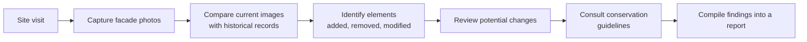
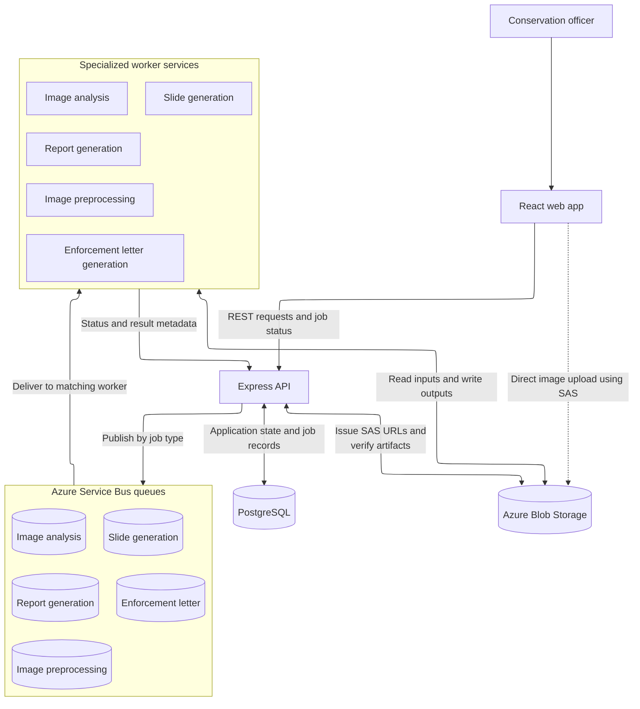
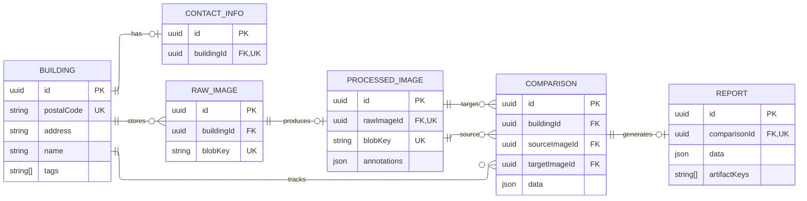

import CaptionedImage from '../../../components/shared/CaptionedImage.astro';
import ScreenshotStack from '../../../components/shared/ScreenshotStack.astro';
import comparisonPage from './pages/comparison.png';
import facadeDetectionPage from './pages/facade-detection.png';
import homePage from './pages/home-page.png';
import reportPage from './pages/report.png';
import slides from './slides.jpg';

## Overview

For my NUS capstone project, I worked in a five-person team building a conservation compliance platform for Singapore's Urban Redevelopment Authority.

URA is responsible for protecting Singapore's conserved buildings, including thousands of heritage shophouses. A key part of that work is identifying whether historical facades have been altered in ways that conflict with conservation requirements.

Our project explored how software and AI could support that process. The platform helps conservation officers maintain a historical record of each building, compare facade images from different points in time, identify potential unauthorized modifications, and prepare evidence for further review.

The system is designed as a decision-support tool rather than an autonomous compliance system. Automated analysis produces an initial set of findings, while officers remain responsible for reviewing changes and deciding what should appear in the final report.

I was the technical lead and sole backend engineer. My work focused on the API and integration layer connecting the frontend, database, Blob Storage, queue, and Python workers, as well as the infrastructure and deployment setup.

### The Problem

URA conservation officers need to understand how protected buildings change over time.

The existing workflow is as follows:



This process has two main pain points:

1. The comparison process is manual. Officers have to inspect facade images and decide whether they contain meaningful differences. Ornate details, obstructions, inconsistent image angles, and poor image quality make this harder.
2. Historical information is fragmented. Building details, images, past comparisons, and reports need to remain connected so officers can understand how a property has changed across multiple inspections.

The project therefore needs to support both change detection and historical tracking while preserving human review.

### The Product

<ScreenshotStack
	images={[
		{
			src: homePage,
			caption: 'Searching the conserved-building registry from an interactive map',
		},
		{
			src: facadeDetectionPage,
			caption: 'Reviewing an automatically detected facade before processing',
		},
		{
			src: comparisonPage,
			caption: 'Comparing historical and current facade images side by side',
		},
		{
			src: reportPage,
			caption: 'Editing an AI-generated conservation compliance report',
		},
	]}
/>

The web application centers around a building registry and an AI-assisted comparison workflow.

Each conserved building has a central record containing its basic information, historical images, and generated reports. Officers can search for buildings, view them on a map, and inspect how the facade has changed over time.

Users can upload historical and current images, run image-quality checks, and crop the relevant facade before processing. The AI pipeline then aligns the images, detects architectural elements, classifies selected features, and identifies elements that appear to be added, removed, modified, or unchanged.

We use a combination of YOLO, GroundingDINO, SAM, ResNet-18, geometric alignment, and GPT-based semantic analysis. The project records 97.29% test accuracy for the ResNet-18 window classifier, which was developed and evaluated by the ML engineers.

The automated output is treated as a draft. Officers can adjust bounding boxes, correct labels, reject false positives, and add changes that the model misses.

The system then generates an editable conservation report containing change descriptions, guideline references, compliance assessments, architectural observations, and recommended actions. Users can also generate presentation slides and a draft enforcement letter.

<CaptionedImage
	src={slides}
	caption="Generated presentation summarizing facade changes, compliance findings, and recommendations"
	size="large"
/>

## Technical Architecture and Infrastructure

The system follows a web-queue-worker design. The diagram below shows the intent of the architecture, while the proof-of-concept implementation is slightly different for simplicity and speed of delivery: 



The React frontend communicates with the Express API through REST endpoints. PostgreSQL stores application state and job records, while Azure Blob Storage holds uploaded images and generated artifacts.

Long-running tasks are directed to a queue based on their workload type. Independently deployed workers consume from those queues, retrieve their inputs from Blob Storage, run the relevant processing logic, and write generated artifacts back to Blob Storage. They then return status and result metadata to the API for validation and persistence.

Separating the queues and workers allows each workload to scale and fail independently.

### Backend and Data Model

The backend is built with Express, TypeScript, Prisma, and PostgreSQL. My work focused on the API and integration layer that connects the frontend, database, Blob Storage, queue, and Python workers.

The relational model represented the core domain: buildings, images, comparisons, reports, contacts, and asynchronous jobs.



Detailed AI outputs are stored as JSON. This decouples the application architecture from the internal representation of the models and allows the models to evolve independently.

The ML engineers can change the shape of detection results, comparison output, or generated report data without requiring the relational schema to change at the same pace. The tradeoff is weaker database-level enforcement inside those payloads, so validation is handled at the application boundary through explicit worker contracts.

### Direct-to-Blob Uploads

Large facade images are uploaded directly from the browser to Azure Blob Storage rather than passing through Express.

The browser first requests a short-lived SAS URL from the backend. After validating the intended filename, MIME type, and size, the backend returns narrowly scoped upload permission.

The browser uploads the file directly, then calls a commit endpoint. The backend verifies the Blob, creates the database record, and queues preprocessing.

This keeps the backend out of the binary transfer path and reduces the risk of Express becoming a memory or bandwidth bottleneck.

The tradeoff is that uploads become a two-step operation. A user can upload a Blob but fail to complete the commit request, leaving an unreferenced file. A lifecycle rule cleans up raw files after a retention period.

### Queue and Worker Design

The proof-of-concept deployment deliberately used a simpler architecture than the production design shown previously.

It had one Azure Service Bus queue and one deployed Python worker component. The component contained both the routing logic and all five specialized handlers. After receiving a job ID, it selected the appropriate handler, loaded the required inputs, executed the task, persisted its outputs, and updated the job status.

This consolidation reduced Azure configuration, local emulator setup, deployment overhead, and duplicated reliability code. It was appropriate for the project scale, where the priority was delivering and demonstrating a complete workflow.

For production, I would separate the backend, queues, and worker deployments. The backend would direct each job to a workload-specific queue, while independently scalable workers would consume from those queues. This matters because the workloads have different operational characteristics:

- Image preprocessing and image analysis are CPU-bound and may require greater compute capacity or specialized hardware.
- Report, slide, and enforcement-letter generation are largely dependent on external API calls and have different timeout and retry behavior.

Separate worker deployments would allow concurrency, resources, retries, timeouts, and scaling policies to be configured for each workload independently.

There are five job types:

1. Image preprocessing: Downloads a raw image, detects and segments facade elements, blurs PII, and stores the processed image and annotations.
2. Image analysis: Compares annotations from two processed images and identifies added, removed, modified, and unchanged elements.
3. Report generation: Combines reviewed comparison results with building data to generate a draft conservation report.
4. Slide generation: Turns report, comparison, and building data into a PowerPoint presentation and stores the generated file.
5. Enforcement-letter generation: Produces a draft enforcement letter as a PDF from the report and related building data.

The intended handler contract lets each ML engineer define the input and output types their model needs and focus on `run_model`. I owned the surrounding adapters that translated between the model-specific contracts and the platform infrastructure, including PostgreSQL, Blob Storage, the queue, and backend job callbacks.

```python
# Implemented by each ML engineer using their own input and output types.
# Allows them to focus on their speciality instead of worrying about storage concerns.
async def run_model(model_input: ModelInput) -> ModelOutput:
    ...

# Implemented by me: dispatch, orchestration, and integration adapters.
async def execute_job(job_id: str) -> None:
    job = await fetch_job(job_id)

    match job["type"]:
        case "imagePreprocessing":
            adapter, model = image_preprocessing_adapter, run_image_preprocessing
        case "imageAnalysis":
            adapter, model = image_analysis_adapter, run_image_analysis
        case "reportGeneration":
            adapter, model = report_adapter, run_report_generation
        case "slideGeneration":
            adapter, model = slides_adapter, run_slide_generation
        case "enforcementLetter":
            adapter, model = letter_adapter, run_enforcement_letter
        case _:
            raise ValueError(f"Unsupported job type: {job['type']}")

    model_input = await adapter.build_input(job)
    model_output = await model(model_input)
    await adapter.persist_output(job, model_output)
```

I also implemented the image-preprocessing worker, including signed-URL downloads and uploads, model execution, PII blurring, annotation persistence, and job status callbacks.

### Deployment

The live environment uses Azure Container Apps, Azure Container Registry, Blob Storage, Service Bus, and PostgreSQL Flexible Server.

The frontend is publicly accessible, while the backend uses internal ingress and the worker has no public ingress. Terraform defines the infrastructure, and GitHub Actions supports linting, tests, builds, and deployment workflows.

I chose Azure Container Apps partly because I had used it during a previous internship. Since the project already involved several unfamiliar technologies, using a deployment platform I knew reduced delivery risk.

The final presentation used the live Azure deployment rather than a local demo.

## Tradeoffs and Hindsight

### Express vs FastAPI

I chose Express because it was the backend framework I knew best at the time, and it allowed the frontend and backend to share TypeScript concepts.

In hindsight, FastAPI may have been simpler. The backend mainly acted as a backend-for-frontend and integration layer, while the processing services were already written in Python. A Python backend could have reduced cross-language contracts and duplicated runtime setup.

### Polling vs Server-Sent Events

The frontend polled the backend every two seconds while waiting for jobs.

For a small proof of concept, this was simple and reliable. For a larger deployment, I would prefer Server-Sent Events or WebSockets to avoid unnecessary repeated requests.

### Shared Queue vs Separate Services

A shared queue keeps the system manageable and reduces Azure configuration, local emulator setup, and duplicated worker logic.

In production, I would split workloads by resource profile. Image processing, LLM generation, and document rendering have different scaling, timeout, and hardware requirements.

### JSON Contracts vs Relational Columns

Keeping model output in JSON allows the AI layer to evolve independently of the database schema. The main risk is contract drift between Python, TypeScript, and the frontend.

Despite this, given the chance to redo this, even for production use cases, I would still stick to JSON contracts instead of fixed columns.

## Outcome

The team delivered an end-to-end working system covering building registration, image upload, AI-assisted comparison, human review, report editing, slide generation, and draft enforcement-letter generation.

The application was deployed on Azure and demonstrated live at NUS STEPS to URA officers, NUS graders, and external visitors. The source code was later handed over to URA.
